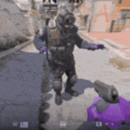

 <samp>
 <b>コンピュータサイエンス</b>
  👋 Hello, I'm Miguel Lamazares 
 </samp>

  

 
 

 
 

<sump>
<b>
More Info
</b>
</sump>

 <h3 align="center">About Me 🧠</h3>  I'm a Computer Science student passionate about technology and programming. Currently, I'm improving my skills in HTML, CSS, and JavaScript while exploring Game Development, Web Programming and web designer.

###

###

 <h3 align="center"> 🌎 Languages</h3>

 
   Portuguese (Native)
   English (B1)  
<h4> Spanish/Brazilian Citizenship 🛂 🇪🇸/🇧🇷</h4>

 

  

   
  

  

    
  

###

<h3 align="center"> 💻 Technologies & Skills Knowledge in: Hardware & Software</h3>

 
  
  
  
  
  
  
  

 <h3> 🚀 Projects</h3>
  🏎️ DrifWiki – A challenge to create an interactive website with animations, providing dynamic car-related content. 

<!---->
 

<picture>
  <source media="(prefers-color-scheme: dark)" srcset="https://raw.githubusercontent.com/miguel-lamazares/miguel-lamazares/output/pacman-contribution-graph-dark.svg">
  <source media="(prefers-color-scheme: light)" srcset="https://raw.githubusercontent.com/miguel-lamazares/miguel-lamazares/output/pacman-contribution-graph.svg">
  
</picture>

###

<h2 align="center"> 📫 Contact</h2>

