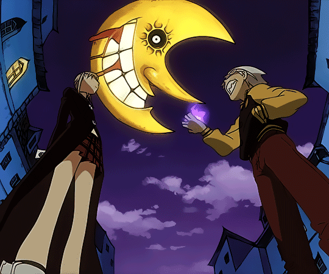

 <samp>
 <b>コンピュータサイエンス</b>
  👋 Hello, I'm Miguel Lamazares 
  Pero, ¿cómo puedo ayudarlo?
 </samp>

 
 

 
 

<sump>
<b>
More Info
</b>
</sump>

 <h3 align="center">About Me 🧠</h3> 
  
 
 I'm Miguel Lamazares, a Computer Science student. I really like technology from hardware to software. 🖥️ 🛠️

 
I believe I made the right choice by learning Java and MySQL, but I'm also very passionate about front-end and game development. ☕ 🐘

 
I'm not only studying programming, I'm also learning English and Spanish. 🇺🇸 🇪🇸

 

###

###

 <h3 align="center"> 🌎 Languages</h3>

 
   Portuguese (Native)   Spanish (Mid)
   English (Mid)  
<h4> Spanish/Brazilian Citizenship 🛂 🇪🇸/🇧🇷</h4>

 
 

  

  

###

<h3 align="center"> 💻 Technologies & Skills Knowledge in: Hardware & Software</h3>

 
  
  
  
   
 
 
 
 
 
  

 

 <h3> 🚀 Projects</h3>
  A big project will arrive 
shortly 

<!--animacoes-->

  <picture>
    <source media="(prefers-color-scheme: dark)" srcset="https://raw.githubusercontent.com/miguel-lamazares/miguel-lamazares/output/pacman-contribution-graph-dark.svg">
    <source media="(prefers-color-scheme: light)" srcset="https://raw.githubusercontent.com/miguel-lamazares/miguel-lamazares/output/pacman-contribution-graph.svg">
    
  </picture>

<!--fim-animacoes-->

<!--codigo-comentado-->
<!--

  

-->
<!--fim-codigo-comentado-->

###

<h2 align="center"> 📫 Contact</h2>

